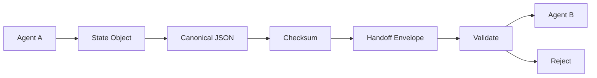
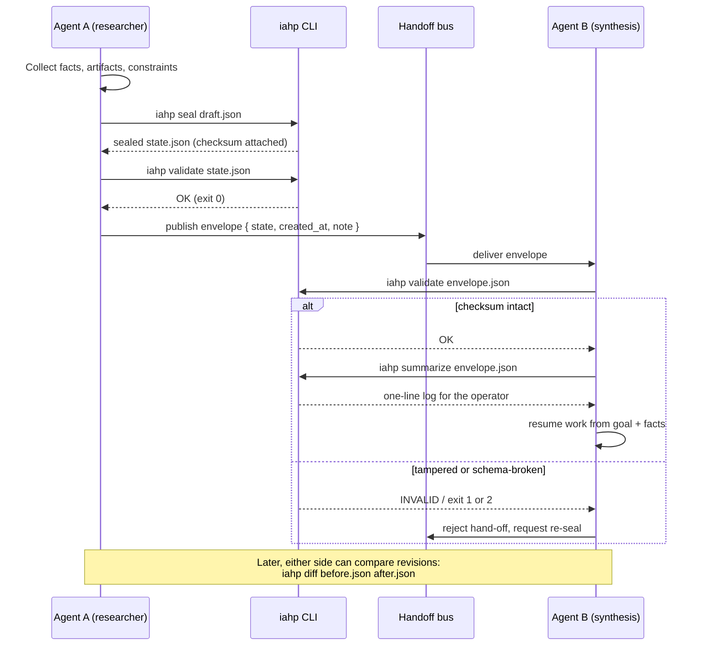

# iahp — Inter-Agent Handshake Protocol

[](https://github.com/medthemed/iahp/actions/workflows/ci.yml)
[](https://github.com/medthemed/iahp/releases)
[](LICENSE)

Portable, checksummed **State Objects** for agent-to-agent hand-offs.

Agent swarms lose context when they pass raw text. IAHP replaces that with a
typed JSON state: goal, constraints, verified facts, artifacts, provenance,
and a SHA-256 checksum over canonical JSON so the receiver can prove nothing
was edited in transit.

## Architecture



## Handoff sequence

A typical research → synthesis hand-off, and which CLI step runs where:



## Install

```bash
npm install
npm run build
```

Local CLI after build:

```bash
node dist/cli.js example
```

Or via `npx tsx` during development:

```bash
npm run cli -- example
```

## CLI

```text
iahp validate <state.json>        # structure + checksum
iahp checksum <state.json>        # print SHA-256 of canonical state
iahp example                      # emit a sealed example state
iahp seal <state.json>            # recompute and attach checksum
iahp summarize <state.json>       # one-line handoff log summary
iahp diff <a.json> <b.json>       # semantic differences [--json]
```

Exit codes for `validate`: `0` ok, `1` schema invalid, `2` schema ok but
checksum mismatch.

### Diffing two states

```bash
# human-readable change list
node dist/cli.js diff before.json after.json

# machine-readable
node dist/cli.js diff before.json after.json --json
```

Diff accepts either bare State Objects or envelopes. Checksums are ignored
on purpose so only semantic changes surface.

## Library

```ts
import {
  buildExampleState,
  createEnvelope,
  verifyEnvelope,
  validateState,
  diffStates,
} from "iahp";

const state = buildExampleState({ goal: "Draft the RFC" });
const env = createEnvelope(state, { note: "research → design" });
const result = verifyEnvelope(env);
if (!result.ok) throw new Error(result.message);

const later = buildExampleState({ goal: "Ship the RFC" });
const diff = diffStates(state, later);
console.log(diff.summary); // "goal changed"
```

## State Object shape

```json
{
  "schema_version": "1.0.0",
  "id": "st_example_001",
  "goal": "…",
  "constraints": ["…"],
  "verified_facts": [
    { "claim": "…", "method": "…", "verified_at": "…", "confidence": 0.9 }
  ],
  "artifacts": [
    { "id": "…", "name": "…", "media_type": "…", "uri": "…" }
  ],
  "provenance": [
    { "actor": "…", "at": "…", "action": "…", "ref": "…" }
  ],
  "handoff_from": "agent-a",
  "handoff_to": "agent-b",
  "checksum": "<sha256 hex of canonical payload>"
}
```

## Checksum rules

Checksum is SHA-256 of the state **without** the `checksum` field, after
canonicalization (object keys sorted recursively, no whitespace). Key order
and pretty-printing never change the digest; semantic edits always do.

## Development

```bash
npm test
npm run typecheck
npm run build
```

See [docs/ARCHITECTURE.md](docs/ARCHITECTURE.md) for module layout and design
decisions. Releases are tracked in [CHANGELOG.md](CHANGELOG.md).

## License

MIT
