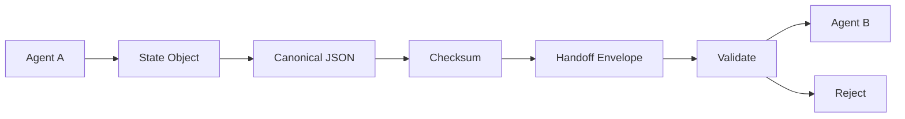
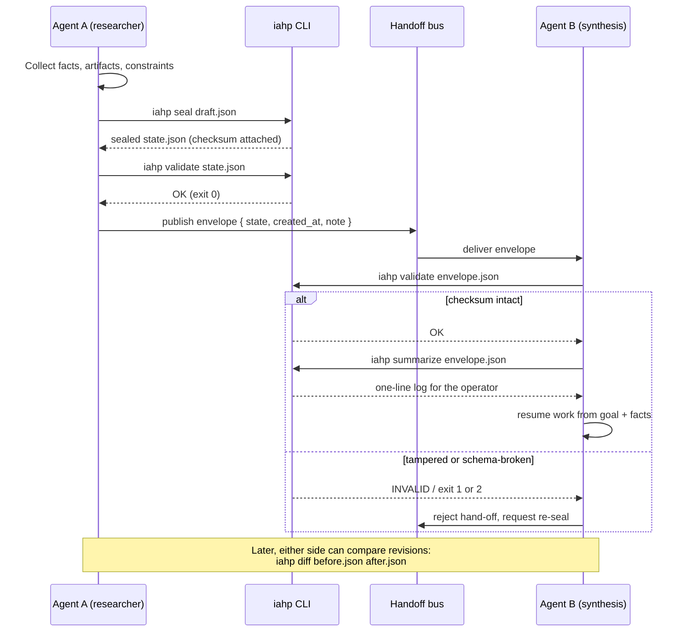

# iahp — Inter-Agent Handshake Protocol

[](https://github.com/medthemed/iahp/actions/workflows/ci.yml)
[](https://github.com/medthemed/iahp/releases)
[](LICENSE)

Portable, checksummed **State Objects** for agent-to-agent hand-offs.

Agent swarms lose context when they pass raw text. IAHP replaces that with a
typed JSON state: goal, constraints, verified facts, artifacts, provenance,
and a SHA-256 checksum over canonical JSON so the receiver can prove nothing
was edited in transit.

## Architecture



## Handoff sequence

A typical research → synthesis hand-off, and which CLI step runs where:



## Install

```bash
npm install
npm run build
```

Local CLI after build:

```bash
node dist/cli.js example
```

Or via `npx tsx` during development:

```bash
npm run cli -- example
```

## CLI

```text
iahp validate <state.json>        # structure + checksum [--format json]
iahp validate-batch <dir>         # validate every *.json in a directory [--format json]
iahp checksum <state.json>        # print SHA-256 of canonical state [--format json]
iahp example                      # emit a sealed example state
iahp seal <state.json>            # recompute and attach checksum
iahp summarize <state.json>       # one-line handoff log summary
iahp diff <a.json> <b.json>       # semantic differences [--format json]
iahp init [state.json]            # scaffold a sealed State Object
```

### Config (`iahp.config.json`)

Optional project file loaded from the working directory (or `--config path`):

```json
{
  "schema_version": "1.0.0",
  "required_fields": ["goal", "constraints", "verified_facts"]
}
```

`validate` fails when a required field is missing or empty. `init` applies
the configured `schema_version` and can write a starter config with
`--write-config`.

```bash
node dist/cli.js init draft.json --goal "Draft the RFC" --from agent-research --to agent-design
```

Exit codes for `validate`: `0` ok, `1` schema invalid, `2` schema ok but
checksum mismatch.

### Batch validation

`validate-batch` walks a directory of `*.json` files (non-recursive), skips
`iahp.config.json` / `package.json`, and classifies each file:

```bash
node dist/cli.js validate-batch states/
```

```text
batch validate: states/
  OK               a-good.json
  SCHEMA INVALID   b-schema.json
    - goal: expected a non-empty string
  INTEGRITY FAILED c-integrity.json
    checksum mismatch: expected …, got …
  UNREADABLE       d-not-json.json
    not valid JSON: …

summary: 4 file(s) — 1 ok, 1 schema-invalid, 0 config-invalid, 1 integrity-failed, 1 unreadable
```

Exit code is `0` only when every file is `ok`; otherwise `1`. The same
logic is available as a library:

```ts
import { validateBatch, formatBatchReport, classifyStateData } from "iahp";

const batch = validateBatch("states/");
console.log(formatBatchReport(batch));
// classifyStateData(file, data, config) is pure — no filesystem access
```

### Diffing two states

```bash
# human-readable change list
node dist/cli.js diff before.json after.json

# machine-readable (stable envelope)
node dist/cli.js diff before.json after.json --format json
```

Diff accepts either bare State Objects or envelopes. Checksums are ignored
on purpose so only semantic changes surface.

## JSON pipe contract

`validate`, `validate-batch`, `checksum`, and `diff` accept `--format json`
(`--json` is a shorthand). Every payload is a small envelope:

```json
{
  "schema_version": "1",
  "ok": true,
  "command": "validate",
  "...": "command-specific fields"
}
```

`schema_version` is currently `"1"`. Additive fields may appear later;
existing fields will not be renamed or removed within the same major
schema version. Exit codes are unchanged by `--format json`.

| Command | Extra fields |
|---|---|
| `validate` | `file`, `status` (`ok` \| `schema_invalid` \| `config_invalid` \| `integrity_failed`), `issues`, optional `message` |
| `validate-batch` | `dir`, `files[]`, `summary` |
| `checksum` | `file`, `checksum`, `schema_ok`, `issues` |
| `diff` | `file_a`, `file_b`, `equal`, `diff` (full `StateDiff`) |

```bash
# pipe-friendly: jq exits non-zero when ok is false
node dist/cli.js validate state.json --format json | jq -e .ok
```

## Library

```ts
import {
  buildExampleState,
  createEnvelope,
  verifyEnvelope,
  validateState,
  diffStates,
  assertSealedState,
  ValidationError,
  ChecksumError,
} from "iahp";

const state = buildExampleState({ goal: "Draft the RFC" });
const env = createEnvelope(state, { note: "research → design" });
const result = verifyEnvelope(env);
if (!result.ok) throw new Error(result.message);

// Throwing accept path — typed errors instead of string matching
try {
  const accepted = assertSealedState(state);
  console.log("accepted", accepted.id);
} catch (err) {
  if (err instanceof ValidationError) console.error(err.issues);
  else if (err instanceof ChecksumError) console.error(err.expected, err.actual);
  else throw err;
}

const later = buildExampleState({ goal: "Ship the RFC" });
const diff = diffStates(state, later);
console.log(diff.summary); // "goal changed"
```

The runtime export catalog is frozen (`PUBLIC_API` / `PUBLIC_API_NAMES`) so
accidental mutation of the export table fails fast.

## State Object shape

```json
{
  "schema_version": "1.0.0",
  "id": "st_example_001",
  "goal": "…",
  "constraints": ["…"],
  "verified_facts": [
    { "claim": "…", "method": "…", "verified_at": "…", "confidence": 0.9 }
  ],
  "artifacts": [
    { "id": "…", "name": "…", "media_type": "…", "uri": "…" }
  ],
  "provenance": [
    { "actor": "…", "at": "…", "action": "…", "ref": "…" }
  ],
  "handoff_from": "agent-a",
  "handoff_to": "agent-b",
  "checksum": "<sha256 hex of canonical payload>"
}
```

## Checksum rules

Checksum is SHA-256 of the state **without** the `checksum` field, after
canonicalization (object keys sorted recursively, no whitespace). Key order
and pretty-printing never change the digest; semantic edits always do.

## Development

```bash
npm test
npm run typecheck
npm run build
```

See [docs/ARCHITECTURE.md](docs/ARCHITECTURE.md) for module layout and design
decisions. Releases are tracked in [CHANGELOG.md](CHANGELOG.md).

## License

MIT
